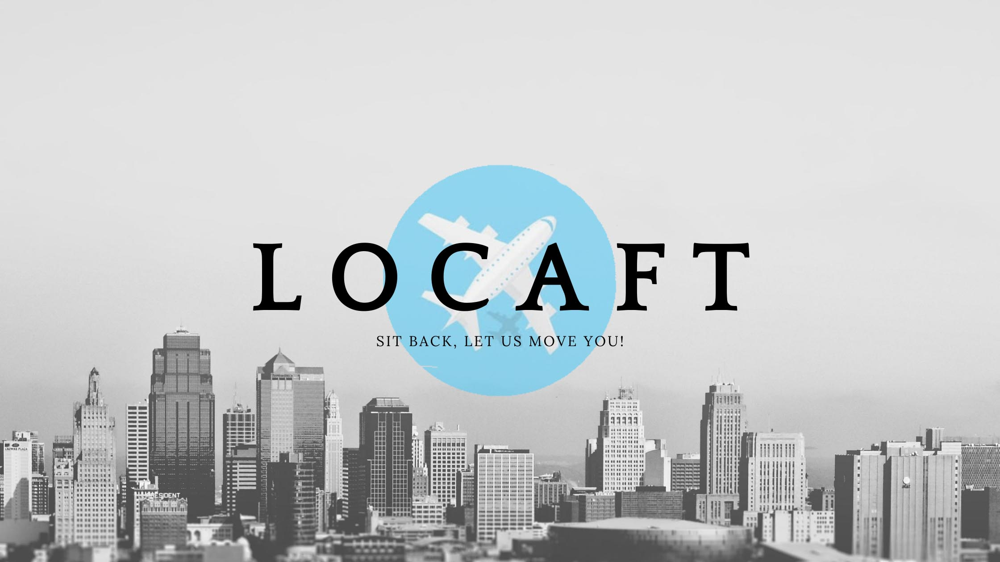

# Locaft

It's a packing and movers along with a conceriage service website.
To better connect both owners and tenants alike.
It features a portal for both the parties to connect,communicate and choose the best deal.

## Available Scripts

In the project directory, you can run:

### `npm start`

Runs the app in the development mode.\
Open [http://localhost:3000](http://localhost:3000) to view it in the browser.

